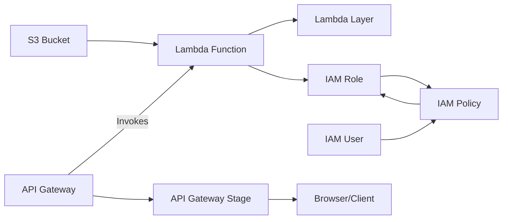

# Table Tennis Scores Terraform Configuration

This repository contains a Terraform configuration for managing AWS resources related to scraping and storing table tennis scores. The configuration includes:

- An S3 bucket for storing scores.
- An IAM role and user for managing resources.
- An IAM policy for managing IAM resources.
- A Lambda function with a layer for scraping scores.

## Prerequisites

- AWS account with necessary permissions.
- Terraform installed on your machine.
- Node.js and AWS CLI for developing and deploying the Lambda function.

## Usage

1. Clone this repository.
2. Initialize Terraform by running `terraform init`.
3. Apply the configuration using `terraform apply`.

## TODO
1. Add tf config to auto deploy the API Gateway
2. CORS